# Практическая работа №16

## Тема: использование функций в модуле   
## Цель: приобрести навыки составления  программ  с использованием   команд для работы с файлами 

### Задачи:

* повторить структуру операторов ввода-вывода и использование файлов, вложенных циклов 
* повторить синтаксис оператора инициализации и ввода-вывода массивов;
* повторить основные библиотечные файлы, подключаемые при выполнении программ;
* усовершенствовать  навыки составления  программ с массивами и файлами.

---

### Задание 1

> Программа должна содержать функцию для вычисления ряда, которую вы поместите в свой модуль. Необходимо предусмотреть контроль ошибок пользователя при вводе данных. Выполнить один вариант с помощью цикла с предусловием, второй вариант – с помощью цикла  с постусловием. Вычислить и вывести на экран в виде таблицы значения функции, заданной с по¬мощью ряда Тейлора, на интервале от Хнач до Хкон с шагом dx с точностью е. Таблицу снабдить заголовком и шапкой. Каждая строка таблицы должна содер¬жать значение аргумента, значение функции и количество просуммированных членов ряда.

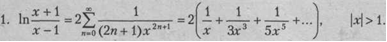  
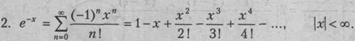  
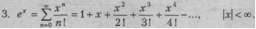  
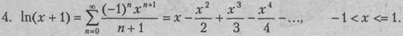  
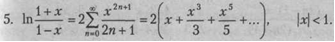  
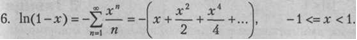  
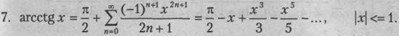  
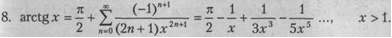  
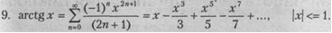  
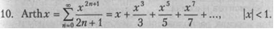  
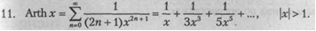  
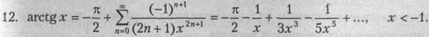  
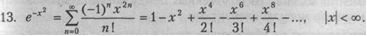  
  
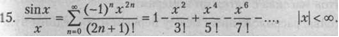  
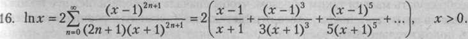  
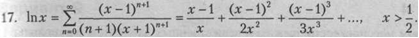  
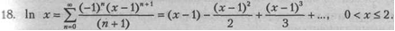  
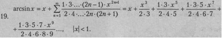  
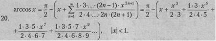  

### Задание 2

Даны 2 массива A[M] и  B[N]. Найдите и выведите минимальное число, которое встречается в обоих массивах.